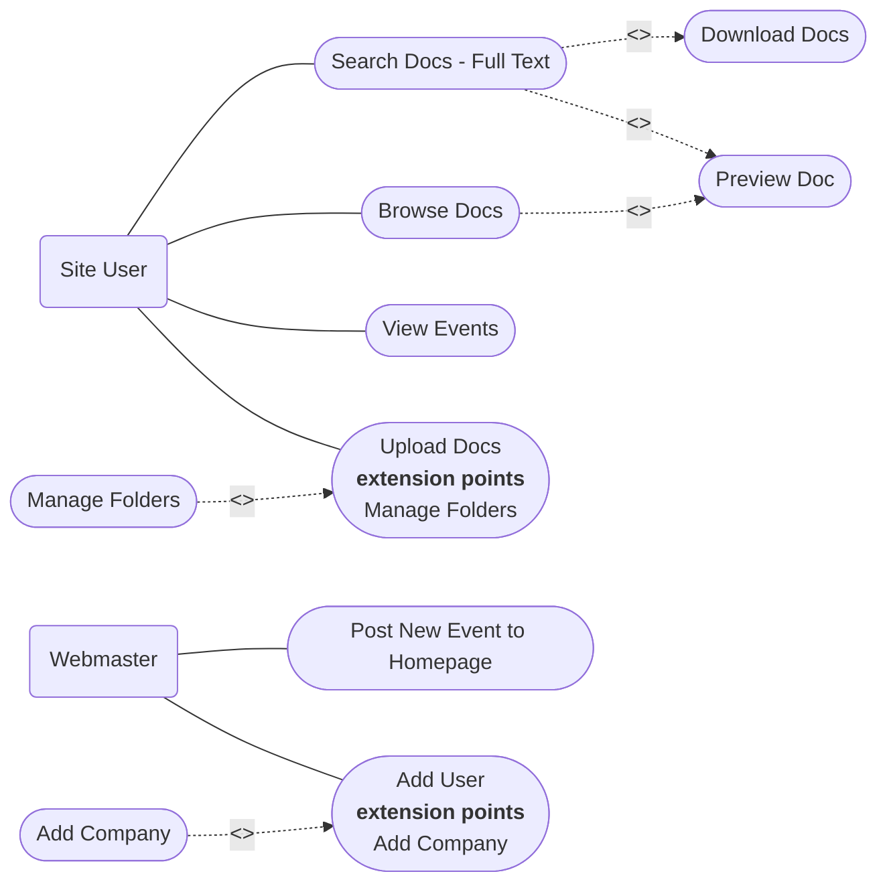

```mermaid
flowchart LR
    %% Actors
    SiteUser("Site User")
    Webmaster("Webmaster")

    %% Use Cases
    SearchDocs(["Search Docs - Full Text"])
    BrowseDocs(["Browse Docs"])
    ViewEvents(["View Events"])
    UploadDocs(["Upload Docs<br/><b>extension points</b><br/>Manage Folders"])
    PostNewEvent(["Post New Event to Homepage"])
    AddUser(["Add User<br/><b>extension points</b><br/>Add Company"])
    
    DownloadDocs(["Download Docs"])
    PreviewDoc(["Preview Doc"])
    ManageFolders(["Manage Folders"])
    AddCompany(["Add Company"])

    %% Actor Relationships
    SiteUser --- SearchDocs
    SiteUser --- BrowseDocs
    SiteUser --- ViewEvents
    SiteUser --- UploadDocs

    Webmaster --- PostNewEvent
    Webmaster --- AddUser

    %% Include Relationships
    SearchDocs -.->|"<<Include>>"| DownloadDocs
    SearchDocs -.->|"<<Include>>"| PreviewDoc
    BrowseDocs -.->|"<<Include>>"| PreviewDoc

    %% Extend Relationships
    ManageFolders -.->|"<<Extend>>"| UploadDocs
    AddCompany -.->|"<<Extend>>"| AddUser
```
